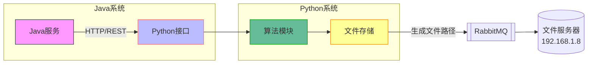
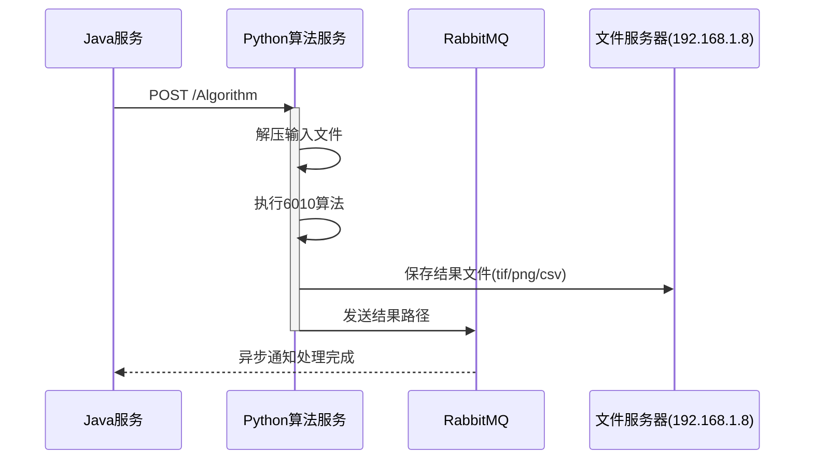
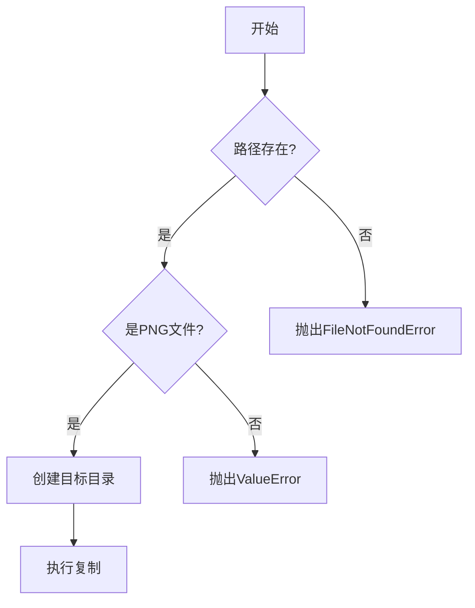
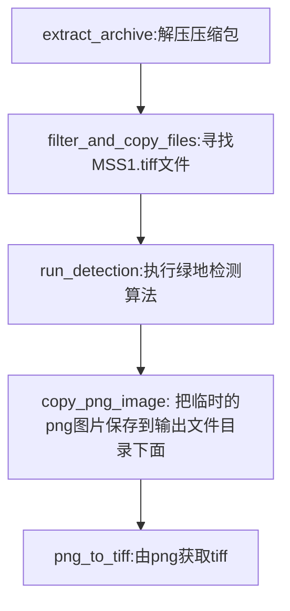

# 西电对接开发规范与使用说明 V1.0

## 一、版本历史

| 版本 | 对接日期                 | 作者   | 修改说明     |
| :--- | :----------------------- | :----- | :----------- |
| 1.0  | 2025.04.13----2025.04.15 | 袁小松 | 编写文档V1.0 |

## 二、对接概述

#### 2.1 任务(业务)描述

* java接口整合参数后请求python接口，python再调用相对应的算法方法

* 算法处理数据完成后，将生成的csv、tif、png等文件成果保存在服务器（192.168.1.8）上面的地址以json的格式（下面示例）上传到RabbitMq上面。



#### 2.2 系统交互流程

1. **请求发起**：Java服务通过HTTP/REST调用Python接口 (西电负责)（请求API见3.1请求说明、样例数据见3.2 请求参数示例） 
2. **数据传递**：Python接口接收请求并解析参数调用算法(已完成)（详见4.1处理流程及4.2核心函数说明文档）
3. **算法处理**：执行算法生成目标文件: csv、tiff、PNG (只完成样例程序)
4. **结果存储**：保存算法生成文件保存至192.168.1.8服务器(已完成) (详见4.1处理流程及4.2核心函数说明文档)
5. **消息通知**：将保存的文件路径构造json传入RabbitMQ(已完成) （详见4.4 RabbitMQ消息推送规范）



## **三、 接口规范**

#### 3.1 请求说明

| 要素         | 值                                   |
| :----------- | :----------------------------------- |
| 方法         | POST                                 |
| URL          | `https://192.168.1.9:8091/Algorithm` |
| Content-Type | application/json                     |
| 保活时长     | 30秒                                 |

#### 3.2 请求参数示例

```json
{
    "inputFile": ["//192.168.1.8/path/to/input.tar.gz"],
    "outputDir": "//192.168.1.8/path/to/output",
    "taskType": "6010",
    "classifyId": "00001"
}
```

#### 3.3 字段说明

| 字段名     | 类型     | 必填 | 说明                                           |
| :--------- | :------- | :--- | :--------------------------------------------- |
| inputFile  | string[] | 是   | 输入文件路径（数组，当前示例仅用第一个元素）   |
| outputDir  | string   | 是   | 结果输出目录                                   |
| taskType   | string   | 是   | 算法类型（当前仅"6010"有效）                   |
| classifyId | string   | 是   | JAVA平台使用，python平台无需关心，传入传出即可 |

## **四、 处理流程说明**

#### 4.1 处理流程

```python
async def run_algorithm_task(request):
    #接受参数
    data = request.json
    task_type = data.get("taskType")
    inputFile = data.get("inputFile")  #输入为一个压缩包列表
    outputDir = data.get("outputDir")
    classifyId=data.get("classifyId")
	#打印接收任务
    print(f"接收到任务: taskType={task_type}, inputFile={inputFile}, outputDir={outputDir}")

    if task_type == "6010":
		#将以tar.gz为后缀的压缩包解压后的文件放入"./resource/data"
        zip_out_filePath = "./resource/data"
       #输入为一个压缩包列表，此处提取第一个压缩包并处理；正常部署应用for循环遍历列表处理每一个输入压缩包
        extract_archive(inputFile[0], zip_out_filePath)
        
        #筛选以suffix(MSS1.tiff)为后缀的文件，并存储到文件名为outdir(targetMSSTIFw)的文件目录下
        outdir = "targetMSSTIF"
        suffix = "MSS1.tiff"
        outdir = "./resource/data/" + outdir + "_need"  #构建完整路径：./resource/data/targetMSSTIF_need
		
        #执行筛选函数filter_and_copy_files开始筛选
        matched_files = filter_and_copy_files(zip_out_filePath, outdir, suffix)
        print(f"matched_files:{matched_files}")
        
        
        #构造输出的TIFF文件名
        TiffFile = matched_files
        TiffFile = TiffFile.replace("\\", "/")
        print(f"地址是{TiffFile}")
        TiffFileName="changed_"+TiffFile.split("/")[-1]

        #执行绿地检测函数得到res。res为一个字典，其键为"png"对应的值存储了绿地检测图片的输出位置,保存在临时目录下：".\\resource\\data\\targetMSSTIF_need"
        res = run_detection(TiffFile)
        res['tif'] = TiffFile
        print(f"得到的结果是:{res}")
        
        #构造输出的PNG图片URL
        png_path = outputDir + "/" + res['png'].split("\\")[-1]
        #将PNG从临时目录".\\resource\\data\\targetMSSTIF_need" 放入输出位置"//192.168.1.8/data/mnt/algResult/xd_sdmj/sdmj/dataResult/1744632248713"
        copy_png_image(res['png'], png_path)
        print(f"png_path:{png_path}")

        #构造输出的TIFF文件URL
        tiff_path = outputDir + "/" + TiffFileName
        #执行PNG转TIFF，获得输出的TIFF
        png_to_tiff(png_path,tiff_path)

    else:
        return json({"msg": "无效的 taskType", "code": "400"})

    # 发送到 RabbitMQ
    send_result_to_mq(
        classifyId=classifyId,
        tif_path=tiff_path,
        png_path=png_path,
        csv_path=output_paths.get("csv"),
        task_type=task_type,
        isDefault=output_paths.get("defaults"),
    )

    return json({"msg": "处理完成（可能使用了模拟数据）", "code": "200"})
```

#### 4.2 核心函数说明文档

##### `png_to_tiff(input_path, output_path)`

将PNG格式图像无损转换为TIFF格式，保留原始图像数据和质量

**参数说明**

| 参数名      | 类型 | 必填 | 说明                                  |
| :---------- | :--- | :--- | :------------------------------------ |
| input_path  | str  | 是   | 源PNG文件路径（支持绝对/相对路径）    |
| output_path | str  | 是   | 输出TIFF文件路径（需包含.tiff扩展名） |

**技术实现**

- 使用Pillow库的`Image.open()`进行图像解码
- 通过`save(format='TIFF')`实现格式转换
- 默认保留原始位深度和色彩模式

------

##### `copy_png_image(source_path, target_path)`

**功能描述**

安全复制PNG图像文件，包含完整的文件校验和目录自动创建功能

**参数验证流程**



**特殊处理**

- 自动创建多级目标目录（`os.makedirs`）
- 使用`shutil.copy2()`保留文件元数据
- 严格校验文件扩展名（大小写不敏感）

**使用示例**

```python
# 复制示例 ,第一个参数为PNG当前的临时位置，第二个参数是应该输出的PNG位置 
copy_png_image(
".\\resource\\data\\targetMSSTIF_need\\GF2_PMS1_E65.8_N40.8_20230418_L1A0007232763-MSS1_marked.png",
"//192.168.1.8/data/mnt/algResult/xd_sdmj/sdmj/dataResult/1744632248713/GF2_PMS1_E65.8_N40.8_20230418_L1A0007232763-MSS1_marked.png"
)
```

------

##### `filter_and_copy_files(source_dir, target_dir, pattern)`

**功能描述**

基于正则表达式模式的文件筛选复制工具，专为遥感影像文件设计

**参数规范**

| 参数名  | 格式要求               | 示例值      |
| :------ | :--------------------- | :---------- |
| pattern | 需包含文件名后缀的正则 | `MSS1.tiff` |

#####  `extract_archive(archive_path, output_dir)`

**功能特性**

- 支持格式：ZIP/TAR/GZ/TAR.GZ
- 自动识别压缩格式
- 失败自动清理残留文件

**解压流程**

1. 格式检测（通过文件头校验）

2. 创建目标目录

3. 多线程解压（ZIP使用`ZipFile`，TAR使用`tarfile`）

4. 返回解压文件列表（含完整路径）


#### **4.3 函数间依赖关系**




#### 4.4 RabbitMQ消息推送规范

**成功响应消息格式标准**

```json
{
  "code": 200,
  "classifyId": "00001",
  "taskType": "6010",
  "result": {
    "csvFilePath": "//192.168.1.8/.../result.csv",
    "tifFilePath": "//192.168.1.8/.../changed_GF2_...-MSS1.tiff",
    "pngFilePath": "//192.168.1.8/.../GF2_...-MSS1_marked.png",
    "dataTime": "2025-04-15 21:49:51"
  }
}
```

**测试结果输出示例：**

```json
{
"code": 200,
"classifyId": "00001",
"taskType": "6010",
"result": {
"csvFilePath": "//192.168.1.8/data/mnt/algResult/xd_sdmj/sdmj/dataResult/1744632248713/result.csv",
"tifFilePath": "//192.168.1.8/data/mnt/algResult/xd_sdmj/sdmj/dataResult/1744632248713/changed_GF2_PMS1_E65.8_N40.8_20230418_L1A0007232763-MSS1.tiff",
"pngFilePath": "//192.168.1.8/data/mnt/algResult/xd_sdmj/sdmj/dataResult/1744632248713/GF2_PMS1_E65.8_N40.8_20230418_L1A0007232763-MSS1_marked.png",
"dataTime": "2025-04-15 21:49:51"
}
```
